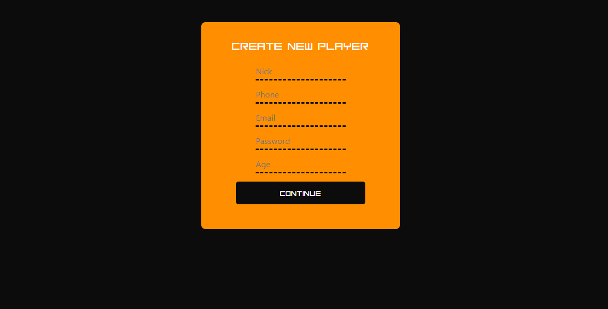

  

# GEEKS DATE FRONT END

## Project details

### This is a React + Laravel PHP project from Fullstack Developer Bootcamp at <a href="https://geekshubsacademy.com/">GeeksHubs Academy</a> 2021.
 

### About
Every project is an oportunity to learn a new way to work. On this case I wanted to do my first REACT + PHP LARAVEL WEB APP ever.

Geeks Date is an webapp like tinder or adoptauntio but focused on freak people. There is a lot of webapps, android apps and iphone apps to meet your perfect partner. Sometimes that kind of apps are focused on user pics rather than their hobbies. There are a big competition out there where people who looks for more interesting partners are not welcome. There are people who wants to share their freak hobbies like watch anime, play tablegames with some friends, play videogames from the couch, do some cosplay or enjoy a nice rolegame event. This is a webapp for them. 

 

- Start date: 20 July 2021
- Delivery date: 13 September 2021
- Dedicated time: > 100 hours 

 

## DEPLOY
<a href="https://geeksdatefront.herokuapp.com/">GeekDates</a>

## TECHNOLOGY

- REACT
- PHP LARAVEL
- SEQUELIZE
- AWS AMPLIFY
- S3 BUCKET
- REDUX
- AXIOS
- GIT FLOW
- SCSS
- POSTMAN
- DBEAVER
- FONT-AWESOME
 
 

## App
<a href="https://dev.d3w0cb2207bqet.amplifyapp.com/">GEEK DATES</a>
 
 

## FROM THE BEGINING

- 1 Clone this repository  
- 2 Install dependencies <code> npm i </code> and execute app <code> npm start </code>
- 3 Get this <a href="https://github.com/VicenteAparicio/FSD_GeekDates_BackEnd">BACKEND</a>
- 4 Execute <code> php artisan serve </code>

 
 

## REGISTER
 
Minimalism design for a good responsive app

  

Your basic data will be register and saved on this page

 
 

## FILL YOUR PERSONAL INFO
 

  

You need to fill this to complete your personal info on the database
 
 

## FILL YOUR SEXUAL INFO AND PREFERENCES

 

  

You need to fill this to complete your sexual info on the database
 
 

## FILL YOUR HOBBIES 

 

  

You need to fill this to complete your hobbies info on the database, without hobbies the users can't not see you on their searchs.
  

## UPLOAD YOUR PHOTO

 

  

Everybody wants to see the face of their future love, let's them discover the beautyfull person you are!!
  

## START YOUR SEARCH!!

 

  

Once you have complete the search process you can go to the EYE on the NAV bar on the top of the screen and look for people with the filters you have there. Filters like range of age or hobbies. 
  

## LOVE IS IN THE CHAT

 

  

When you get some matches you can go to the HEART on the NAV bar and go to Matches/Lovers section. On this section you will have a view of all your MATCHES. If you click over the little arrow at the right of the name, you will see your conversation whith that partner.
  

In case you don't want to talk with someone anymore you can click on the X (at the left of the name) to do UNMATCH. 

  

## CONCLUSION

 
Geeks Dates have been one of the hardest projects on my learning. First time I had to work with REACT and PHP LARAVEL in a full project. I had to learn a lot about PHP LARAVEL, the querys and how to extract information from another tables with relations between them. I have to be very patient looking for the errors and how to fix them (very easy when you work with NODE JS).

From the begining I felt like the concept of my database and front-end was not good to this complex app. I wasn't able to see the right way to work with the tables and their relations. I spent weeks to figure out how to manage the data to get all the info I needed for the front-end area. Days with no commits fighting with the code and the big information google could provide me. Days burning my brain and my confidence about the skills I am getting over this months. 

Was a nice ride, hard but nice. I learned a lot of new stuff and thousand of ways of how not do something.

  

## THINGS I LEFT TO DO... FOR NOW

 
1.- Add custom alert messages 
2.- Improve hobbie filters 
3.- Add city filter 
4.- Add country filter 

  

## THANKS
Thank to all my teachers and classmates to become part of my learning. 

